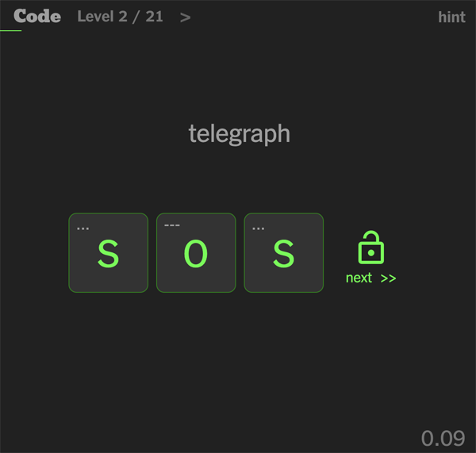

# Code

Code is a series of cryptography puzzles. It is written in ReactJS and deployed to GitHub pages.

https://hughmandeville.github.io/code/



# Running Locally

```
npm install
npm start
```

# Puzzles

There are different types of puzzzles.

- _Sequences_ Sequences of numbers or letters (e.g. Fibonacci, Pi, days of the week.
- _Encoded Messages_ Encrypted or encoded messages (e.g. ROT13, Morse Code, Pig Latin).
- _Phrases_ - Word phrases (e.g. Cockney sayings).

# Other Puzzle Idea

### And / Or Gates

Show simple circuit diagram with zeros and ones and 'and' and 'or' and 'not' gates.
Have enter output.
